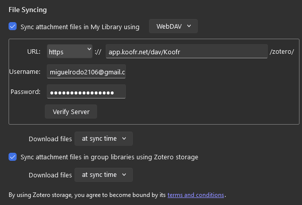

# Essential math

## Essential packages

To have full access to mathematical symbols and fonts, include these in your preamble:

```latex
\usepackage{amsmath}   % Core logic and environments
\usepackage{amssymb}   % Extended library of symbols (e.g., set notation)
\usepackage{amsfonts}  % Specialized math fonts (e.g., blackboard bold)
```

## Display vs. inline math

LaTeX distinguishes between math that appears within a sentence and math that stands alone in its own block.

* Inline Math: Use `$...$` or `\( ... \)` to include math within a paragraph.
* Display Math: Use `\[ ... \]` or an environment (like `equation`) to center the math on its own line.

For example, the following:

```latex
The formula for the area of a circle is $A = \pi r^2$ (inline). 
Alternatively, it can be displayed as:

\[
A = \pi r^2
\]
```

renders as:

The formula for the area of a circle is $A = \pi r^2$ (inline). 
Alternatively, it can be displayed as:

$$
A = \pi r^2
$$

## Common Environments

**The "Star" Versions (Unnumbered)**

By default, environments like `equation` and `align` add a number on the right. To hide the number, append an asterisk:

```latex
\begin{align*}
  y &= mx + c \\
  y &= 2x + 5
\end{align*}
```

**The `cases` Environment**

Used for piecewise functions:

```latex
\[
f(x) = 
\begin{cases} 
  x  & \text{if } x \geq 0 \\
  -x & \text{if } x < 0 
\end{cases}
\]
```

## Matrices

Use the following enviroments for creating matrices:

* **`pmatrix`**: Uses parentheses $( \dots )$
* **`bmatrix`**: Uses square brackets $[ \dots ]$

For example:

```latex
\[
A =
\begin{pmatrix}
  a_{11} & a_{12} \\
  a_{21} & a_{22}
\end{pmatrix}
\]
```

displays as

$$
A =
\begin{pmatrix}
  a_{11} & a_{12} \\
  a_{21} & a_{22}
\end{pmatrix}
$$

## Text inside Math

All letters inside `LaTeX` math environments display as italic.
To include normal text, use the `\text{...}` command.

For example, $E = mc^2$ with an explanation would be written as:

```latex
\[
E = mc^2 \quad \text{where } m \text{ is the mass.}
\]
```

and render as:

$$
E = mc^2 \quad \text{where } m \text{ is the mass.}
$$

# Bibliographies

In academic writing, we support and attribute statements we make by citing sources.
For example, we write "The Earth revolves around the Sun (Copernicus, 1543)" in our text, and then include metadata about the source (author, title, year, etc.) in a bibliography at the end of the document.

In `LaTeX`, one cites references in-text using `\cite{<key>}`, e.g. `\cite{einstein1905}`, which then becomes, for example, a number (`[1]`).
A bibliography at the end specifies the metadata for each such citation.

There are several ways to manage references in `LaTeX`, all of which we describe below.
You will either use `natbib` or `biblatex`, so skip to the end of the section if you want to get straight to those.
Either works, and you can start with one and switch to the other later, or use a different one for different projects.

## Comparison of reference systems

<table>
  <thead>
    <tr>
      <th>System</th>
      <th>Automation Level</th>
      <th>Style Control</th>
      <th>Primary Benefit</th>
    </tr>
  </thead>
  <tbody>
    <tr>
      <td>Zero Reference Manager</td>
      <td>Manual</td>
      <td>Hard-coded</td>
      <td>None, really.</td>
    </tr>
    <tr>
      <td>BibTeX</td>
      <td>Automatic</td>
      <td><code>.bst</code> files, hard to customise</td>
      <td>Automatic bibliography generation</td>
    </tr>
    <tr>
      <td>natbib</td>
      <td>Automatic</td>
      <td><code>.bst</code> files, hard to customise</td>
      <td>Can use author-year in-text citations. Journals often use <code>.bst</code> files.</td>
    </tr>
    <tr>
      <td>biblatex</td>
      <td>Automatic</td>
      <td><code>LaTeX</code> commands, easier to customise</td>
      <td>Fast and easier to style.</td>
    </tr>
  </tbody>
</table>

## `thebibliography` environment

[Overleaf help: bibtex](https://www.overleaf.com/learn/latex/Bibliography_management_with_bibtex)

This approach is entirely manual, requiring you to order, style, and write every entry in the bibliography yourself, like so:

```latex
\begin{thebibliography}{9}
\bibitem{texbook}
Donald E. Knuth (1986) \emph{The \TeX{} Book}, Addison-Wesley Professional.
\bibitem{latexcompanion}
Michel Goossens, Frank Mittelbach, and Alexander Samarin (1993) \emph{The \LaTeX\ Companion}, Addison-Wesley, Reading, Massachusetts.
\end{thebibliography}
```

If you decide to change anything about the bibliography, such as the order of entries or the formatting, you will have to change it manually in the text.
This is not practical.
For this reason, the automated methods below were developed.
No-one actually handles bibliographies manually, but I included this here because all the methods below essentially automatically generate the above `thebibliography` environment.

## `bibtex`

The `bibtex` approach requires no additional packages.
What it does require is a plain text file that is essentially the database of all your references.
Individual entries look like this:

```latex
@book{latexcompanion,
    author    = "Michel Goossens and Frank Mittelbach and Alexander Samarin",
    title     = "The \LaTeX\ Companion",
    year      = "1993",
    publisher = "Addison-Wesley",
    address   = "Reading, Massachusetts"
}
```

The citation key for this entry is `latexcompanion`, and so you cite this using `\cite{latexcompanion}`.
`bibtex` will recognise that you cited `latexcompanion` and will use the `.bib` file to generate its bibliography entry.

To insert the bibliography, you add the `\bibliography` command, specifying the path to the `.bib` file but dropping the `.bib` extension:


```latex
\bibliography{references}
```

The `.bib` file referred to is named `references.bib`.

To style the bibliography, you make use of preset styles, specified using the `\bibliographystyle` command before the `\bibliography` command.

```latex
\bibliographystyle{plain}
\bibliography{references}
```

## natbib

[Overleaf help: natbib](https://www.overleaf.com/learn/latex/Bibliography_management_with_natbib)

`bibtex` automated the bibliography generation, but it could only give numeric in-text citations (e.g. `[2]`) and not `author-year` citations (e.g. `(Goossens et al., 1993)`).

To use `natbib`:

- In your preamble, load the package and specify the style (optional to specify style):

```latex
\usepackage{natbib}
\bibliographystyle{abbrvnat}
```

Note that now we must load a package, and the style is specified in the preamble.

- Cite your sources using `\cite{}`, `\citet{}` (textual, e.g `Knuth (1995)`), or `\citep{}` (parenthetical, e.g. `(Knuth, 1995)`).
- Specify the bibliography file and where you want the bibliography to appear in the body: `\bibligraphy{<bib_file>}`, where again we drop the `.bib` extension.

The main disadvantage of `natbib` is that styling the bibliography relies in `.bst` files, which are (apparently) extremely hard to modify.
It can also be slow, and not treat non-English languages well.
But for most documents, it is perfectly fine, and many journals want you to use their own `.bst` files.

## `biblatex`

[Overleaf help: biblatex](https://www.overleaf.com/learn/latex/Bibliography_management_with_biblatex)

`biblatex` allows you to specify the style using `LaTeX` options and commands, rather than `.bst` files.
The upshot for this is that granular control is much easier, as with `natbib` you simply find an acceptable `.bst` file and use it, but with `biblatex` you can easily modify the style to your liking.

`biblatex` is also faster and works better with non-English languages.

To use `biblatex`:

- In your preamble, load the package and specify the `.bib` files:

```latex
\usepackage[style=alphabetic, sorting=ynt]{biblatex}
\addbibresource{<bib_file>.bib}
```

Note that you specify the style as an option to the package, and the bibliography file is specified in the preamble.
Multiple bibliography files can be added with multiple `\addbibresource` commands.

- Cite references using `\cite` (I think there are more flexible options, but I have not looked this up)
- Specify where to place the bibliography using `\printbibliography`.

To customise `biblatex`, see the Overleaf documentation (as for `natbib`).

# `R` in `LaTeX`

We can both display `R` code as text and run `R` code to include results in our document.

## Displaying `R` code

To include R code as text without executing it (e.g., in an appendix), the `minted` package is easy to use and displays code elegantly.

To use `minted`:

- Add the following to your preamble to set the global style for your R code:

```latex
\usepackage{minted}

\setminted{
    fontsize=\small,
    breaklines=true,
    linenos,
    frame=lines
}
```

The above settings define the visual style of your code blocks as follows:

* `fontsize=\small`: Makes text smaller, which helps it fit.
* `breaklines=true`: Automatically wraps long lines of code.
* `linenos`: Adds line numbers.
* `frame=lines`: Places horizontal rules above and below the code snippet demarcate it.

None of the above settings are required, but `breaklines` in particular is very helpful.

In your document, you can include an external R script file or write the code directly in the LaTeX editor.

**To include an external file:**

```latex
\inputminted{r}{your_script.R}
```

**To write code inline:**

```latex
\begin{minted}{r}
# This is an R comment
summary(cars)
plot(cars)
\end{minted}
```

## Running `R` code

[Overleaf knitr documentation](https://docs.overleaf.com/integrations-and-add-ons/r-code-knitr#Introduction)

You can actually run `R` code in your `.tex` document on Overleaf.

To do this:

**Rename file**: Rename your primary file extension from `.tex` to `.Rtex`, e.g. from `main.tex` to `main.Rtex`.

**Internal `R` code**: Insert `R` code inside `<<>>= ... @` chunks:

```latex
<<>>=
# R code goes here
@
```

All `knitr` chunk options are available, e.g.

```latex
<<chunk-name, echo=TRUE, eval=FALSE>>=
# R code here
@
```

**In-line references**: Refer to results with `\Sexpr{}`, e.g. `The result is \Sexpr{2 + 2}.` or `The result is \Sexpr{mean(x)}.` where `x` has been defined in a previous chunk.

**External R scripts**: If you prefer to keep your R code in a separate `.R` file, you can import it into your `main.Rtex` document using the `read_chunk` function. 

You will need to format the script in a specific way. In your `.R` file, identify chunks using a specific comment header: `## - chunk-label`. For example:

```r
## - chunk-name-1
# R code here

## - chunk-name-2
# R code here
```

Read the script into your LaTeX document using a code chunk:

```latex
<<>>=
read_chunk("my_script.R")
@
```

The first chunk is automatically run (`chunk-name-1` in the example above).

Specify later chunks using their label name, e.g.

```latex
<<chunk-name-2, echo=TRUE>>=
@
```

### Visualizing data

Plots can be generated in this way:

```latex
set.seed(2)
hist(rnorm(100), main="Sample Histogram", xlab="Value")
@
```

Standard `knitr` chunk options work:

```latex
<<histogram-plot, fig.pos="t", fig.height=4, fig.width=4, fig.cap="Standard Normal Distribution">>=
set.seed(2)
hist(rnorm(100), main="Sample Histogram", xlab="Value")
@
```

The plot can be then be references with `\ref{fig:<chunk-name>}`, e.g. `\ref{fig:histogram-plot}`.

### `R` version and available packages

On Overleaf, the `R` version is old (version 3.6.3) and the packages are limited to what Overleaf has already installed.

You can view the installed `R` packages by adding this to an `.Rtex` file:

```latex
<<>>=
pkgVec <- installed.packages()[, "Package"] 
pkgVecNull <- setNames(pkgVec, NULL) 
sort(pkgVecNull)
@
```

# Zotero

A brief plug for my reference manager, Zotero (please follow this link for a discount: [link](https://www.arsenal.com)).
Alternatives include Mendeley and EndNote, but I have ended up at Zotero for the following reasons:

- At some point, both Mendeley and EndNote broke for me.
- Zotero is free, unlike EndNote.
- Zotero opens up very quickly.
- Zotero has a good browser extension for quickly adding references from the web.
- Zotero libraries can be kept cheaply in the cloud.
  - Zotero itself offers 300MB free, which is a pittance, and the cheapest usable tier for me is \$60 year year for 6GB.
  - It is very easy, however, to use `WebDAV` to sync your library on `koofr.net`, which offers 10GB free. I asked Gemini how to do it and it took me five minutes.


To set up Zotero:

- Create an account at www.zotero.org
- Install Zotero:
  - The Desktop app: https://www.zotero.org/support/installation
    - This is where you add your references.
  - Browser extension: Install the `Zotero Connector` browser extension for your browser.
     - This allows you to add journal papers from their webpages.  
- Set up syncing:
  - Zotero help page: https://www.zotero.org/support/sync
  - If you want to use Zotero's own cloud storage:
    - It's easy to set up here: https://www.zotero.org/storage
  - If you want to use `WebDAV` to sync with `koofr.net`:
    - Create an account at `koofr.net`
    - Generate an app password in `koofr.net`:
      - Under `Preferences` > `Password` > `App passowrds`, click on `Generate` and copy the password.
    - In Zotero, go to `Edit` > `Settings`:
      - Enter your Zotero username and password in the `Data syncing` tab (whilst your files will be kept on koofr.net, the metadata and Zotero library is still kept in zotero.org)
      - In the `File syncing` section, make your settings look like mine below, replacing the username with yours and the password with the app password you generated in `koofr.net`:



- To add files to Zotero, you can do one of the following:
  - Using the browser extension
  - Drag and drop them into the desktop app
- You can also import just the citations using `File > Import` in the desktop app. Useful if you don't have access to the PDF (paywall).

- To export your library to a `.bib` file for use in `LaTeX`:
  - In the desktop app, click `File > Export Library`, select `BibTeX` as the format, and save the file.
  - To make the exported `.bib` file better, and in particular to make the citation keys more informative, see this guide: https://fishandwhistle.net/post/2020/getting-started-zotero-better-bibtex-rmarkdown. 

# Overcoming Overleaf limitations

## Collaboration

On the free plan, you can only have two editors per project.
If you have more than two people, you have several options:

- Pay \$10  per month or \$98 per year for the Student plan, which has many (unlimited?) collaborators.
- Use a view link for all group members, and remove people not currently writing anything.

## Compile timeouts

On the free plan, you have a shorter compile time limit and slower servers, and some documents may not compile in time.
Again, you have several options:

- Pay for the Student plan, which has a longer compile time limit and faster servers.
- Optimise your document to reduce compile time, such as by:
  - Using PDF images instead of PNGs or SVGs.
  - Compiling parts of the document separately and reading them with `\includepdf[pages=-]{file.pdf}`.
    - This will require fiddling with page numbers to make them follow on correctly.
  - Following other advice from Overleaf: https://docs.overleaf.com/troubleshooting-and-support/fixing-and-preventing-compile-timeouts#steps-to-resolve-compile-timeouts
- Switching to Quarto/RMarkdown and compiling to PDF locally.
  - To do this:
    - Copy your preamble into a `preamble.tex` file and tell Quarto/RMarkdown to use it in the YAML frontmatter.
    - Specify the output format as PDF.
    - Copy the body of your document into the `.Rmd`/`.qmd` file.
  - This should, in theory, simply work if you have `LaTeX` set up locally, but you may get difficulties because `Quarto` and `RMarkdown` specify their own premable, into which your preamble is merged/added.
    - This can cause conflicts and change the point at which your preamble is inserted.

# Presentations

Presentations in `LaTeX` are created using the `beamer` document class.
Two minor changes follow from this:

- Specify document class as `beamer` in the preamble: `\documentclass{beamer}`
- Instead of `\section{Slide title}`, use `\begin{frame}{Slide title}` and `\end{frame}` to define each slide.

For example:

```latex
\documentclass{beamer}

% Choose a theme
\usetheme{Madrid} 

\begin{document}

\begin{frame}{Slide Title}
    This is a basic slide in Beamer.
    \begin{itemize}
        \item Everything inside the frame environment appears on this slide.
    \end{itemize}
\end{frame}

\end{document}
```

To avoid the entire slide appearing at once, you can use the `\pause` command (please make use of this).
`LaTeX` essentially creates "two slides" at each `\pause`: one with the content before the `\pause`, and one with the content after the `\pause`.


